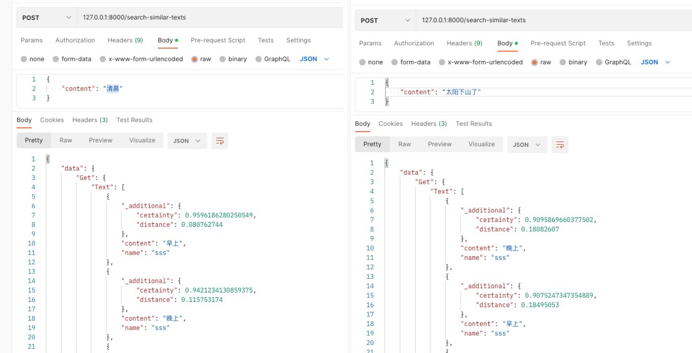

# VecTextSearch
## 项目介绍
VecTextSearch 是一个使用 OpenAI 语言模型生成文本向量并在 Weaviate 数据库中进行高效搜索的项目。它允许用户将文本数据存储在 Weaviate 数据库中，并根据文本相似性快速搜索和检索相关文本。项目使用 Golang 编写，并提供一个简单的 REST API 供客户端调用。

## 聊天记录
[聊天记录1](history/chat1.md)

## 效果



## 项目背景
在许多实际应用中，需要基于文本相似性进行快速搜索。例如，给定一篇文章，可以找到与其内容相似的其他文章。传统的基于关键词的搜索方法可能无法准确捕捉到文本之间的相似性。VecTextSearch 利用 OpenAI 的强大语言模型将文本转换为向量表示，然后使用 Weaviate 数据库进行高效的相似向量搜索。

## 用处与使用场景
VecTextSearch 可以应用于以下场景：

- 为文章、博客、论文等寻找相关内容。
- 实现智能问答系统，根据用户提问快速匹配到相关问题及答案。
- 构建推荐系统，根据用户的阅读历史为其推荐相似文章。
- 检测重复或抄袭的内容。

## 接口介绍
VecTextSearch 提供了两个 REST API 接口：

### 添加文本
- URL: /add-text
- Method: POST
- Content-Type: application/json
- Request Payload:

```json
{
  "name": "文章名称",
  "content": "文章内容"
}
```
- Response: 成功添加文本后，将返回一个包含文本 ID 的 JSON 对象。

```json
{
  "id": "文章唯一标识符"
}
```

### 搜索相似文本
- URL: /search-similar-texts
- Method: POST
- Content-Type: application/json
- Request Payload:

```json
{
  "content": "查询内容"
}
```

Response: 搜索成功后，将返回一个包含相似文本信息的 JSON 对象。

```json
{
  "data": [
    {
      "id": "文章唯一标识符",
      "name": "文章名称",
      "content": "文章内容",
      "distance": "与查询内容的距离"
    },
    ...
  ]
}
```

## 部署与运行
请参考项目的 Dockerfile 和 docker-compose.yml 文件，使用 Docker 和 Docker Compose 部署和运行 VecTextSearch 及其依赖的 Weaviate 服务。具体部署和运行方法，请参考本仓库中的 Docker 部署指南。

注意：在运行项目之前，请确保您已经配置了 config.yml 文件，设置了正确的 OpenAI API 密钥和 API 端口。

## 开发与贡献
如果您想为 VecTextSearch 做出贡献或者对项目进行二次开发，您可以按照以下步骤操作：

1. 克隆本仓库到本地：

```bash
git clone https://github.com/szpnygo/VecTextSearch.git
```

2. 进入项目目录并安装相关依赖：

```bash
cd VecTextSearch
go get -u
```

3. 在 config.yml 文件中填写正确的 OpenAI API 密钥。

4. 运行项目：

```bash
go run main.go
```

如果您在使用 VecTextSearch 时遇到问题或者有新的想法和建议，欢迎提交 Issue 或 Pull Request。我们非常感谢您的贡献和支持！

## 许可证
VecTextSearch 采用 MIT 许可证。有关详细信息，请参阅 LICENSE 文件。

## 联系我们
如果您在使用 VecTextSearch 过程中遇到任何问题，请随时与我们联系。您可以通过以下方式联系我们：

- 在 GitHub 仓库中提交 Issue
- 发送电子邮件至：st2udio@gmail.com
