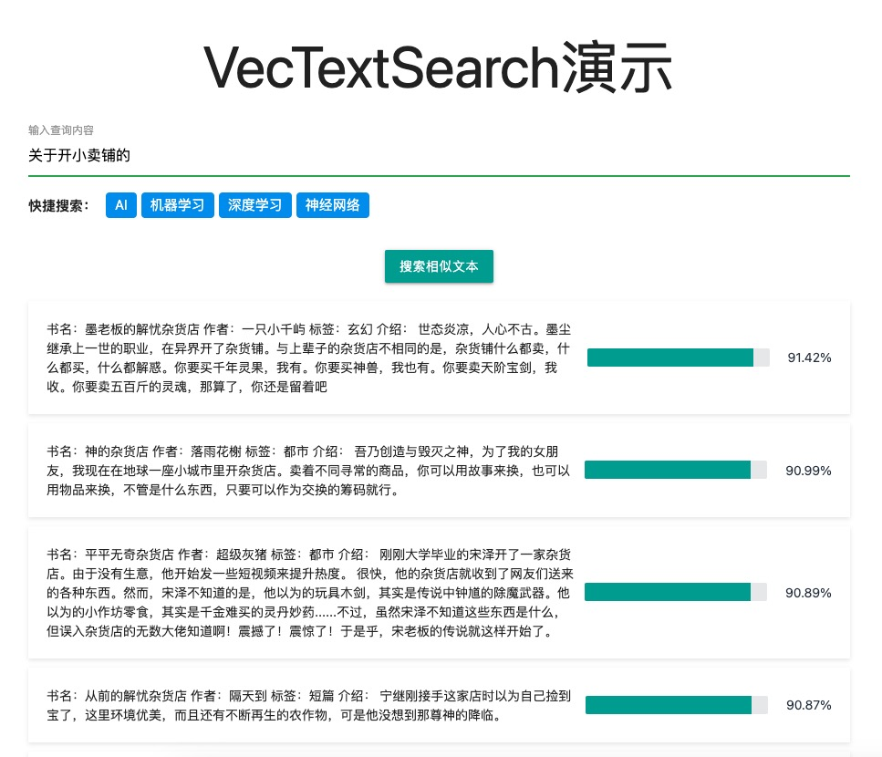

# VecTextSearch

[](https://github.com/szpnygo/VecTextSearch)


VecTextSearch is a project that generates text vectors using OpenAI language models and performs efficient searches in the Weaviate database. It allows users to store text data in the Weaviate database and quickly search and retrieve related texts based on text similarity. The project is written in Golang and provides a simple REST API for clients to call.

## Project Introduction
VecTextSearch is a project that uses OpenAI language models to generate text vectors and efficiently searches them in the Weaviate database. It allows users to store text data in the Weaviate database and quickly search and retrieve related texts based on text similarity. The project is written in Golang and provides a simple REST API for client calls.

## Chat logs
[Chat log 1](history/chat1.md) - Creating the project

[Chat log 2](history/chat2.md) - Modifying Dockerfile and Makefile

[Chat log 3](history/chat3.md) - Simplifying vector search results, modifying data structures

[Chat log 4](history/chat4.md) - Refactoring project structure

[Chat log 5](history/chat5.md) - Downloading ChatGPT chat logs directly as Markdown files

[Chat log 6](history/chat6.md) - Adding CORS support, fixing errors in the make run command

## Effects
### postman


### web


### flutter


## Project Background
In many practical applications, fast searches based on text similarity are needed. For example, given an article, you can find other articles similar to its content. Traditional keyword-based search methods may not accurately capture the similarity between texts. VecTextSearch utilizes OpenAI's powerful language models to convert text into vector representations and then uses the Weaviate database for efficient similar vector searches.

## Use Cases and Scenarios
VecTextSearch can be applied to the following scenarios:

- Finding related content for articles, blogs, papers, etc.
- Implementing intelligent Q&A systems, quickly matching related questions and answers based on user queries.
- Building recommendation systems, recommending similar articles based on users' reading history.
- Detecting duplicate or plagiarized content.

## TODO List

- [ ] **Develop a demo application**：Create a demo application that intuitively showcases VecTextSearch features and use cases.
- [ ] **Add data management interface**：Provide a data management interface for the project, making it easier for users to manage text data stored in the Weaviate database.
- [ ] **Develop a user-friendly frontend interface**：Simplify the use of VecTextSearch and provide users with a better experience.
- [ ] **Provide detailed documentation**：Write detailed documentation including API references, usage examples, and tutorials.
- [ ] **Provide more configuration options**：Allow users to adjust the performance and functionality of VecTextSearch according to their needs.
- [ ] **Add unit tests and integration tests**：Ensure code quality and stability.
- [ ] **Follow updates to OpenAI language models**：Continuously monitor updates and improvements to OpenAI language models, and apply the latest technologies to VecTextSearch in a timely manner.
- [ ] **Develop plugins or extension systems**：Allow users to customize the functionality of VecTextSearch according to their needs.


## Interface Introduction
VecTextSearch provides two REST API interfaces:

### Add Text
- URL: /add-text
- Method: POST
- Content-Type: application/json
- Request Payload:

```json
{
  "name": "article name",
  "content": "article content"
}
```
- Response: After successfully adding the text, a JSON object containing the text ID will be returned.

```json
{
  "id": "unique article identifier"
}
```

### Search Similar Texts
- URL: /search-similar-texts
- Method: POST
- Content-Type: application/json
- Request Payload:

```json
{
  "content": "query content"
}
```

- Response: After a successful search, a JSON object containing similar text information will be returned.

```json
{
  "data": [
    {
      "id": "unique article identifier",
      "name": "article name",
      "content": "article content",
      "distance": "distance from the query content",
      "certainty": "similarity to the query content"
    },
    ...
  ]
}
```

## Makefile Function Description

- `make init`：Create a .env file template for configuring environment variables.
- `make build`Build the Docker image.
- `make push`：Push the Docker image to Docker Hub.
- `make run`：Run the application locally.

## Start Weaviate Vector Database
```bash
docker run -d \
  --name weaviate \
  -p 8888:8080 \
  --restart on-failure:0 \
  -e QUERY_DEFAULTS_LIMIT=25 \
  -e AUTHENTICATION_ANONYMOUS_ACCESS_ENABLED=true \
  -e PERSISTENCE_DATA_PATH='/var/lib/weaviate' \
  -e DEFAULT_VECTORIZER_MODULE='none' \
  -e ENABLE_MODULES='' \
  -e AUTOSCHEMA_ENABLED=true \
  -e CLUSTER_HOSTNAME='node1' \
  semitechnologies/weaviate:1.18.1 \
  --host 0.0.0.0 \
  --port 8080 \
  --scheme http
```

## ChatGPT to Markdown Chrome Extension

ChatGPT to Markdown is a Chrome extension developed by ChatGPT, designed to help users easily download ChatGPT's conversation logs with OpenAI as Markdown files. The generated Markdown files will contain the entire conversation content, clearly distinguishing between the user and the assistant. This extension makes it easy for users to organize and review chat logs, improving work efficiency.

Main features:

- Add a "Download Markdown" button to the ChatGPT conversation page
- Convert the entire conversation log to Markdown format
- Automatically generate chat log paragraphs with "Neo" (user) and "ChatGPT" (assistant) as headings

For detailed instructions and usage，please refer to the[ChatGPT to Markdown plugin](history/extension/)documentation


## Development and Contribution
If you would like to contribute to VecTextSearch or develop the project further, you can follow the steps below:

1. Clone the repository locally:

```bash
git clone https://github.com/szpnygo/VecTextSearch.git
```

2. Enter the project directory and install the necessary dependencies:

```bash
cd VecTextSearch
go get -u
```

3. Fill in the correct OpenAI API key in the config.yml file.

4. Run the project:

```bash
go run main.go
```

If you encounter any problems using VecTextSearch or have new ideas and suggestions, please feel free to submit an Issue or Pull Request. We greatly appreciate your contributions and support!


## License
VecTextSearch is licensed under the MIT License. For more information, please refer to the LICENSE file.

## Contact Us
If you encounter any issues while using VecTextSearch, please feel free to contact us. You can reach us through the following methods:

- Submit an Issue in the GitHub repository
- Send an email to: st2udio@gmail.com
